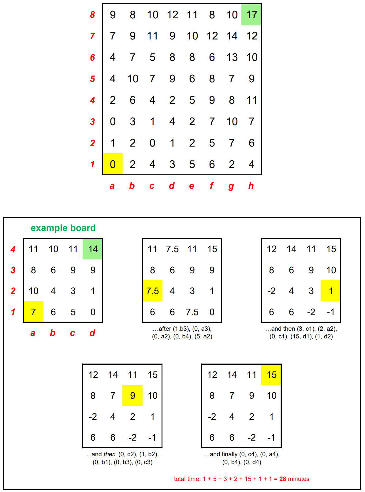

# Knight Moves 5

It is my implementation of a Jane street puzzle called _Knigt Moves 5_.

## Game rules

An 8-by-8 “lattice” is represented above. 
A knight arrives at a1 at time T=0, and wishes to travel to the upper-right corner (h8).
This lattice respresents a 3-dimensional landscape; the numbers at each “point” represent their altitudes.

But there’s a big problem here, which is that this grid was built on a swamp, and the lattice points are prone to sinking. 
Whenever the knight arrives on a lattice point of altitude A, that point and all others with the same altitude start sinking at the rate of 1 unit per n minutes, where n is the number of lattice points of altitude A.
Furthermore, the lattice point diametrically opposite the one the knight is on rises at the rate of 1 unit per n minutes.
This sinking (and rising) continues only while the knight remains stationary, which may be for as much or as little time as the knight chooses.
No other points move or begin to move during this time.
(Altitudes can become negative. In the event that the “opposite” point is at the same initial altitude, it neither rises nor sinks, and is ignored for the purpose of calculating n.)

The knight is only allowed to make 3-dimensional jumps that are permutations of (0,±1,±2).
Jumps take 0 time to complete.
In the spirit of a knight’s “tour”, your goal is to find the path to the upper-right corner that takes as much time as possible.
Tours of 180 minutes or longer are eligible for the leaderboard.

Updated 11/6: Due to some shortsightedness on our part we forgot to include the following extra rule.
All “sinks” in a tour must be necessary sinks.
That is, if a jump (t, P) has t > 0, it must be the case that there exists a value t’ such that replacing (t, P) with (t’, P) would result in an illegal move or would cause a move later in the tour to be illegal.
(Our tour operator regrets the oversight.)

To enter, send in a comma-separated list of moves.
Please use the notation (t , P) to describe a move, where t is the number of minutes you wait at your current lattice point before jumping to lattice point P.
(The 19-move sequence in the example above would begin “(1, b3), (0, a3), (0, a2),…”). 
Your tour ends as soon as you first reach h8; all other lattice points may be visited at most 3 times.
(Your starting state at a1 counts towards this limit.)
